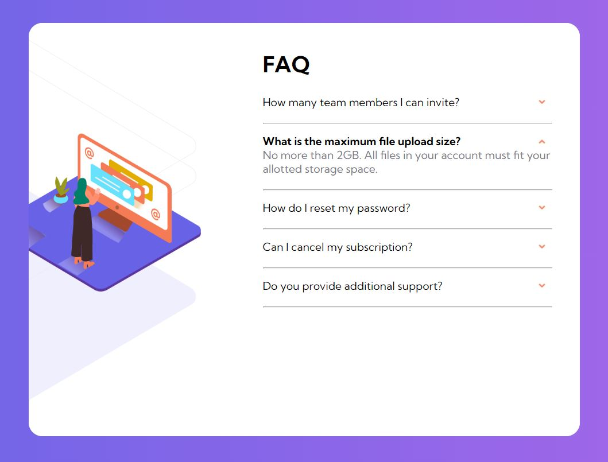

# FAQ Accordion Card

This is a simple FAQ Accordion Card project created as a solution for the Frontend Mentor challenge [Frontend Mentor](https://www.frontendmentor.io/challenges/faq-accordion-card-XlyjD0Oam). The project aims to create an interactive FAQ section with collapsible accordion-style questions and answers.



You can view the live demo of this project [FAQ section](https://mehwishjbe.github.io/FAQ-accordion-card/).

## Table of Contents

- [Project Overview](#project-overview)
- [Features](#features)
- [Usage](#usage)

## Project Overview

This project consists of a single HTML page with an FAQ section. Each FAQ item can be expanded or collapsed when clicked, providing a smooth user experience for accessing information. It utilizes HTML, CSS, and JavaScript to achieve this functionality.

## Features

- Interactive FAQ section with accordion-style questions and answers.
- Accessible and user-friendly interface.

## Project Structure

The project structure is simple and includes the following files and directories:

- `index.html`: The main HTML file containing the FAQ section page.
- `style.css`: The CSS stylesheet for styling the page.
- `main.js/`: This directory contains the JavaScript file, main.js, which contains the code responsible for handling handling accordion functionality like     expand or collapse it.
- `images/`: A directory containing image assets used in the project.

## Usage

To use or modify this project, follow these steps:

1. Clone the repository to your local machine:

   ```bash
   git clone https://github.com/mehwishjbe/FAQ-accordion-card.git
